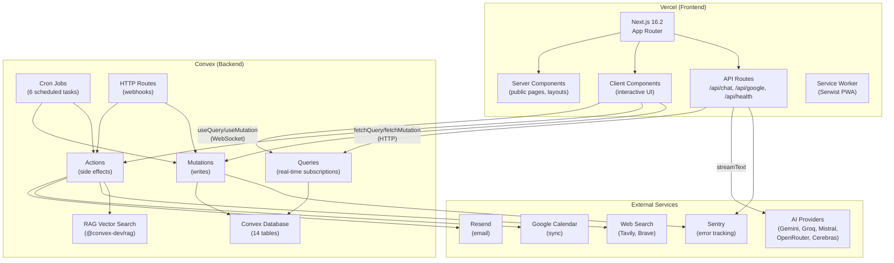
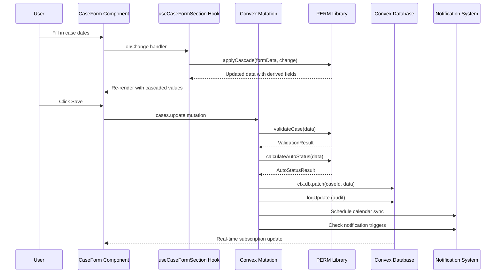
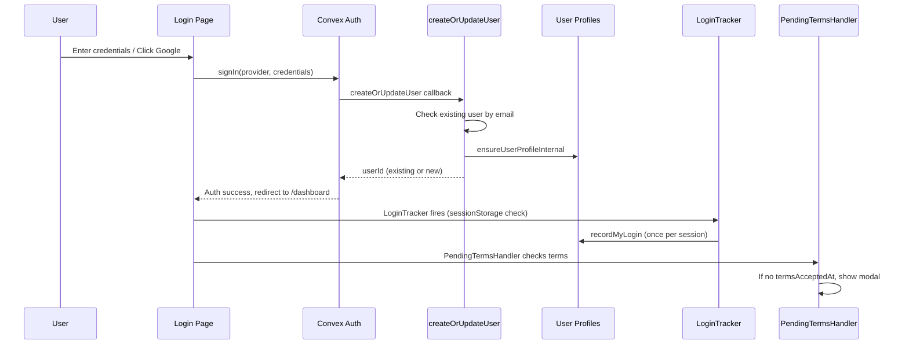
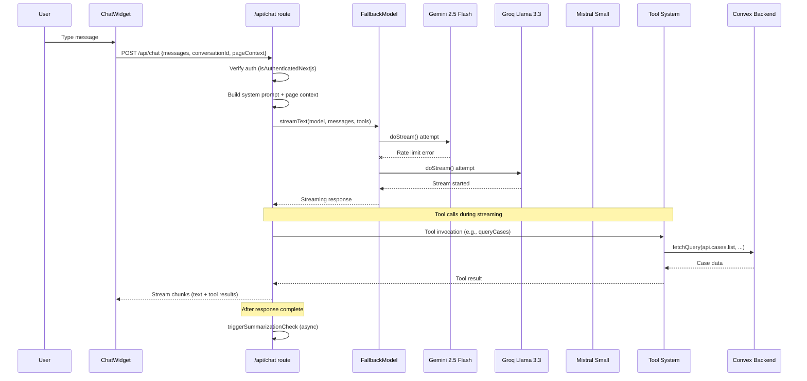
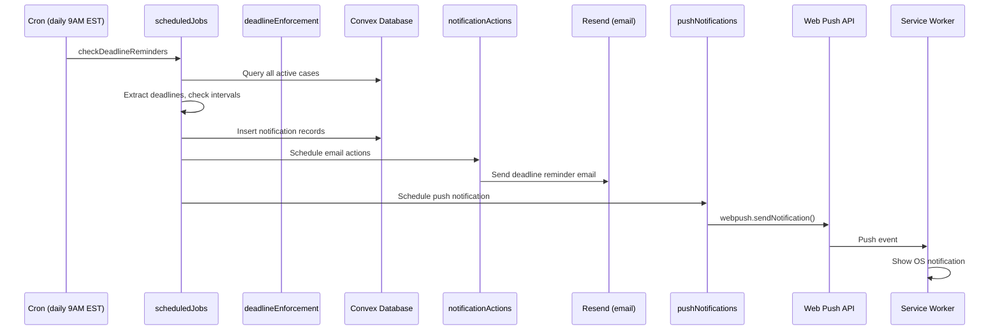
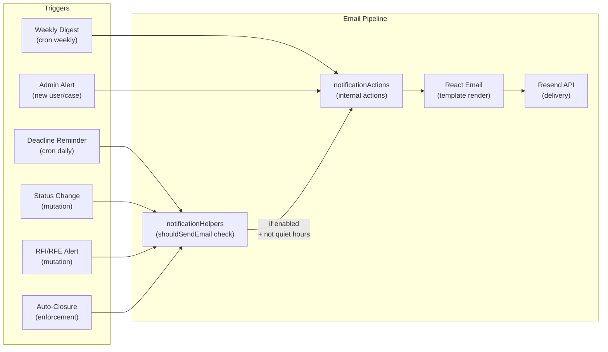
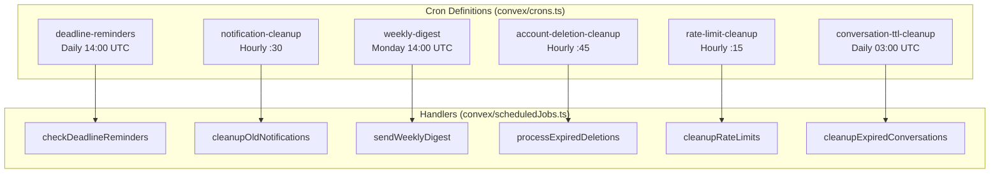
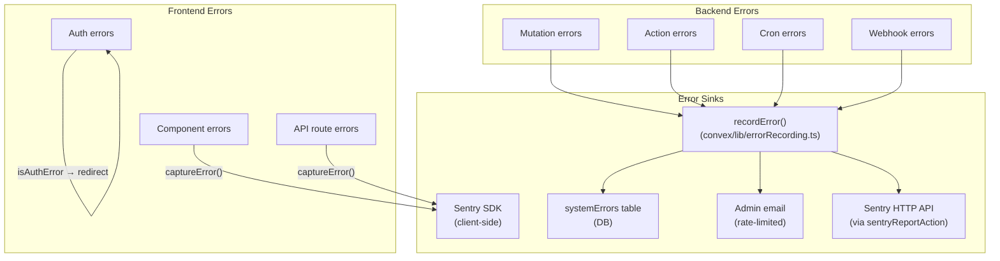
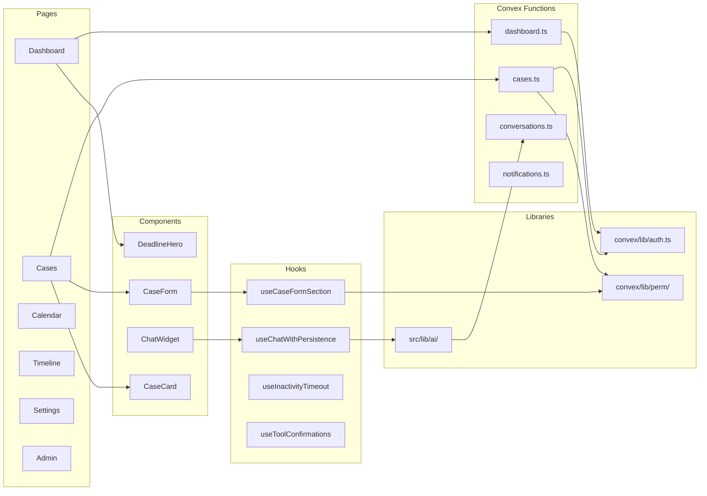

# Architecture

**Analysis Date:** 2026-02-21
**Last Updated:** 2026-05-24 (version refresh)

## Pattern Overview

**Overall:** Serverless full-stack application with a real-time backend (Convex) and a Next.js App Router frontend deployed on Vercel.

**Key Characteristics:**
- **Frontend/Backend split**: Next.js 16.2 (Vercel) + Convex 1.39 (serverless backend-as-a-service)
- **Real-time data**: Convex provides live-updating queries via WebSocket subscriptions
- **Centralized business logic**: All PERM business rules live in `v2/convex/lib/perm/` (single source of truth)
- **Multi-provider AI chat**: Streaming AI chatbot with 5-model fallback chain and 25+ tools
- **Three layout groups**: Public (marketing), Auth (login/signup), Authenticated (app)
- **Event-driven notifications**: Cron-based deadline checks, push notifications, email via Resend

## System Architecture Diagram

## Layers

**Presentation Layer (Next.js App Router):**
- Purpose: Renders UI, handles routing, manages client-side state
- Location: `v2/src/app/`, `v2/src/components/`
- Contains: Pages (RSC + Client), components, layouts, API routes
- Depends on: Convex client SDK, AI SDK, Radix UI, shadcn/ui
- Used by: End users via browser

**API Layer (Next.js Route Handlers):**
- Purpose: Server-side endpoints for AI chat streaming, Google OAuth, health checks
- Location: `v2/src/app/api/`
- Contains: `chat/route.ts` (streaming AI), `google/` (OAuth flow), `health/`, `sentry-check/`
- Depends on: Convex server SDK (`fetchQuery`/`fetchMutation`), AI SDK (`streamText`)
- Used by: Client components via fetch

**Backend Logic Layer (Convex Functions):**
- Purpose: All server-side business logic, data access, authorization
- Location: `v2/convex/*.ts`
- Contains: Queries, mutations, actions, HTTP routes
- Depends on: `convex/lib/` helpers, schema
- Used by: Frontend via Convex client SDK, cron scheduler

**Business Logic Layer (PERM Library):**
- Purpose: All PERM-specific calculations, validations, cascade rules
- Location: `v2/convex/lib/perm/` (canonical), `v2/src/lib/perm/` (re-exports)
- Contains: Deadline calculators, validators, cascade rules, status types
- Depends on: `date-fns` for date math
- Used by: Convex mutations, frontend components

**Helper/Utility Layer (Convex Lib):**
- Purpose: Shared helpers for auth, audit, notifications, calendar, errors
- Location: `v2/convex/lib/`
- Contains: Auth guards, audit logging, notification helpers, calendar sync, error recording
- Depends on: Convex server types
- Used by: All Convex functions

**Frontend Library Layer:**
- Purpose: Client-side utilities, hooks, AI integration, content processing
- Location: `v2/src/lib/`, `v2/src/hooks/`
- Contains: AI providers/tools, auth context, content MDX processing, form utilities
- Depends on: Convex client SDK, AI SDK, date-fns
- Used by: Components and pages

## Data Flow

### Case CRUD Flow

### Authentication Flow

**Key auth details:**
- `ConvexAuthNextjsServerProvider` wraps root layout for SSR auth
- `ConvexProviders` (client) wraps only auth/authenticated layouts -- public pages skip Convex entirely
- Password auth with OTP verification (`ResendOTP.ts`) and password reset (`ResendPasswordReset.ts`)
- Google OAuth with email-based account linking (prevents duplicate accounts)
- `createOrUpdateUser` callback fires for OAuth and new accounts, NOT for password sign-ins
- Login tracking is client-side via `LoginTracker` component using `sessionStorage`
- Inactivity timeout: 15-min idle, 2-min warning modal, multi-tab sync via BroadcastChannel

### AI Chat Architecture

**AI chat details:**
- `FallbackModel` class in `v2/src/lib/ai/providers.ts` implements `LanguageModelV3` interface
- 5 models across 5 providers: Gemini (primary) -> Groq -> Mistral -> OpenRouter -> Cerebras
- Per-request isolation via `forRequest()` -- no shared state between requests
- 25+ tools organized by permission tier: AUTONOMOUS (read-only), CONFIRM (data modification), DESTRUCTIVE
- Tool confirmation system: action mode setting per user (off / confirm / auto)
- Page context injection: `PageContextProvider` tracks current page, visible cases, filters
- Conversation persistence in Convex (`conversations` + `conversationMessages` tables)
- Conversation summarization: async compression when message count exceeds threshold
- Tool result caching via `toolCache` table (TTL-based)
- Knowledge base: RAG vector search over PERM regulations (`@convex-dev/rag`)
- Web search: Tavily (primary) + Brave (fallback) with daily rate limits tracked in `apiUsage` table

### Push Notification Flow

### Email Notification Flow

**Email templates** (React Email, in `v2/src/emails/`):
- `DeadlineReminder.tsx`, `StatusChange.tsx`, `RfiAlert.tsx`, `RfeAlert.tsx`
- `AutoClosure.tsx`, `WeeklyDigest.tsx`, `WelcomeEmail.tsx`
- `AccountDeletionConfirm.tsx`, `AdminEmail.tsx`, `TestEmail.tsx`
- `VerificationCode.tsx`, `PasswordResetCode.tsx`

## Cron / Scheduled Jobs Architecture

**All cron handlers are `internal` functions** -- never exposed to the client API.

## Error Handling Architecture

**Error handling strategy:**
- Frontend: `captureError()` from `v2/src/lib/sentry.ts` wraps Sentry SDK (179+ call sites)
- Backend: `recordError()` from `v2/convex/lib/errorRecording.ts` -- one call does DB + admin email + Sentry
- Auth errors (`isAuthError` check) redirect to `/login?expired=1`
- Global error boundary: `v2/src/app/global-error.tsx`
- Component-level: `ErrorBoundary` in `v2/src/components/ui/error-boundary.tsx`

## State Management Patterns

**No client-side state library.** State is managed via:

1. **Convex subscriptions** (primary): `useQuery()` hooks subscribe to Convex queries via WebSocket. Data is always fresh and synchronized across tabs.

2. **React Context** (auth/UI state):
   - `AuthContext` (`v2/src/lib/contexts/AuthContext.tsx`): Sign-out state machine (idle -> signingOut)
   - `PageContextProvider` (`v2/src/lib/ai/page-context.tsx`): Tracks current page, visible cases for AI chat context
   - `OnboardingProvider` (`v2/src/components/onboarding/OnboardingProvider.tsx`): Wizard/tour state
   - `CaseFormContext` (`v2/src/components/forms/CaseFormContext.tsx`): Form-level case state
   - `SettingsUnsavedChangesContext` (`v2/src/components/settings/SettingsUnsavedChangesContext.tsx`)

3. **Component state** (`useState`/`useReducer`): Form inputs, UI toggles, filter state

4. **localStorage** (persistence): Case list filters, sort preferences, dismissed deadlines

5. **sessionStorage** (per-session): Login tracking flag (prevents duplicate `recordMyLogin` calls)

6. **BroadcastChannel** (multi-tab sync): Inactivity timeout synchronization across browser tabs

## API Layer Design

### Convex Functions (Backend)

| File | Type | Purpose |
|------|------|---------|
| `convex/cases.ts` | query/mutation | Case CRUD, listing, search, pagination |
| `convex/dashboard.ts` | query | Dashboard deadline/summary/activity queries |
| `convex/notifications.ts` | query/mutation | Notification CRUD, mark read, dismiss |
| `convex/conversations.ts` | query/mutation | Chat conversation management |
| `convex/conversationMessages.ts` | query/mutation | Chat message persistence |
| `convex/users.ts` | query/mutation | User profile CRUD, settings |
| `convex/admin.ts` | query/mutation | Admin dashboard (user summary, management) |
| `convex/timeline.ts` | query | Timeline view data |
| `convex/calendar.ts` | query | Calendar view data |
| `convex/deadlineEnforcement.ts` | query/mutation | Auto-closure logic |
| `convex/knowledge.ts` | action | RAG knowledge base search |
| `convex/webSearch.ts` | action | Web search (Tavily/Brave) |
| `convex/notificationActions.ts` | action | Email sending via Resend |
| `convex/pushNotifications.ts` | action | Web push via web-push |
| `convex/googleCalendarActions.ts` | action | Google Calendar API calls |
| `convex/scheduledJobs.ts` | internalAction/internalMutation | Cron job handlers |
| `convex/supportEmail.ts` | action | Inbound email processing |
| `convex/dataExport.ts` | action | User data export |
| `convex/http.ts` | httpAction | Webhook endpoints (Resend inbound) |

### Next.js API Routes (Frontend Server)

| Route | Method | Purpose |
|-------|--------|---------|
| `/api/chat` | POST | AI chat streaming endpoint |
| `/api/chat/execute-tool` | POST | Tool execution for client-side confirmation flow |
| `/api/google/connect` | GET | Initiate Google OAuth flow |
| `/api/google/callback` | GET | Google OAuth callback |
| `/api/google/disconnect` | POST | Remove Google integration |
| `/api/health` | GET | Health check |
| `/api/sentry-check` | GET | Sentry configuration check |

## Key Abstractions

**PERM Business Logic Module (`convex/lib/perm/`):**
- Purpose: Single source of truth for all PERM deadline calculations and validations
- Files: `cascade.ts`, `calculators/`, `validators/`, `dates/`, `recruitment/`, `utils/`, `deadlines/`
- Pattern: Pure functions operating on `CaseData` type, no side effects
- Re-exported from `src/lib/perm/` for frontend usage

**Cascade System (`convex/lib/perm/cascade.ts`):**
- Purpose: Automatically compute dependent date fields when a source field changes
- Examples: `pwdDeterminationDate` -> `pwdExpirationDate`, `eta9089CertificationDate` -> `eta9089ExpirationDate`
- Pattern: DAG of `CascadeRule` definitions, applied via `applyCascade()`

**Derived Calculations (`convex/lib/derivedCalculations.ts`):**
- Purpose: Compute filing window, recruitment window from multiple date fields
- Called on every case create/update mutation
- Stored in DB for queryability (indexed fields)

**FallbackModel (`src/lib/ai/providers.ts`):**
- Purpose: Multi-provider AI model with automatic sequential fallback
- Implements `LanguageModelV3` interface from AI SDK
- Per-request isolation via `forRequest()` to prevent shared state issues

**Auth Helpers (`convex/lib/auth.ts`):**
- Purpose: User authentication and authorization guards for all Convex functions
- Key functions: `getCurrentUserId()`, `getCurrentUserIdOrNull()`, `verifyOwnership()`, `verifyFirmAccess()`
- Pattern: Every public query/mutation calls auth helpers first

**Error Recording (`convex/lib/errorRecording.ts`):**
- Purpose: Unified error capture -- one function call sends to DB + admin email + Sentry
- Pattern: `recordError(ctx, source, operation, error, opts)` schedules async recording

**Content System (`src/lib/content/`):**
- Purpose: MDX article processing for content hub (blog, tutorials, guides, resources, changelog)
- Files: `index.ts` (content loading), `mdx-components.tsx` (custom components), `types.ts`, `seo.ts`
- Pattern: Static content in `content/` directory, processed with `next-mdx-remote` + `gray-matter`

## Entry Points

**Root Layout:** `v2/src/app/layout.tsx`
- Server component, wraps everything with `ConvexAuthNextjsServerProvider`, `SharedProviders`
- Loads fonts (Space Grotesk, Inter, JetBrains Mono), structured data, analytics

**Public Layout:** `v2/src/app/(public)/layout.tsx`
- Marketing pages, no Convex WebSocket connection
- Uses `SharedProviders` only (theme, toaster, nav links)

**Auth Layout:** `v2/src/app/(auth)/layout.tsx`
- Login, signup, reset-password pages
- Uses `ConvexProviders` for auth operations

**Authenticated Layout:** `v2/src/app/(authenticated)/layout.tsx`
- Full app experience with all providers
- Includes: Header, Footer, ChatWidget, InactivityTimeoutProvider, OnboardingProvider
- Includes: LoginTracker, PendingTermsHandler, ServiceWorkerRegistration, SentryContext

**Convex Backend Entry:** `v2/convex/convex.config.ts`
- Defines Convex app, registers RAG plugin

**Convex Auth Entry:** `v2/convex/auth.ts`
- Defines auth providers (Google OAuth, Password with OTP)
- Contains `createOrUpdateUser` callback for email-based account linking

**Convex HTTP Entry:** `v2/convex/http.ts`
- HTTP router for webhooks (Resend inbound email)
- Auth routes added via `auth.addHttpRoutes()`

**Convex Schema:** `v2/convex/schema.ts`
- Single source of truth for all 14+ database tables
- Includes indexes, field types, relationships

**Cron Entry:** `v2/convex/crons.ts`
- 6 scheduled jobs (deadline reminders, cleanups, weekly digest)

## Cross-Cutting Concerns

**Logging:** Structured logger via `convex/lib/logging.ts` with named loggers (`loggers.cases`, `loggers.email`, `loggers.deadline`, etc.). Frontend uses `console.*` with `[Component]` prefixes.

**Validation:** Two layers:
1. Input validation: `convex/lib/validation.ts` (string length limits, input sanitization)
2. Business validation: `convex/lib/perm/validators/` (PERM-specific rules per 20 CFR 656)

**Authentication:** `convex/lib/auth.ts` provides `getCurrentUserId()`, `getCurrentUserIdOrNull()`, `verifyOwnership()`, `verifyFirmAccess()`. Every public function must call one of these. Admin guard in `convex/lib/admin.ts`.

**Audit Logging:** `convex/lib/audit.ts` provides `logCreate()`, `logUpdate()`, `logDelete()` -- writes to `auditLogs` table with field-level change tracking.

**Rate Limiting:** `convex/lib/rateLimit.ts` + `convex/authRateLimit.ts` -- protects auth endpoints from brute force. Records tracked in `rateLimits` table, cleaned hourly.

**Encryption:** `convex/lib/crypto.ts` -- encrypts sensitive fields (FEIN, Google OAuth tokens) at rest.

**Calendar Sync:** `convex/lib/calendarSyncHelpers.ts` + `convex/googleCalendarSync.ts` + `convex/googleCalendarActions.ts` -- manages Google Calendar event creation/update/deletion for case deadlines.

## Dependency Graph (Key Relationships)

## Database Tables (14 tables)

| Table | Purpose | Key Indexes |
|-------|---------|-------------|
| `users` | Auth core (from @convex-dev/auth) | `email`, `by_deleted_at` |
| `userProfiles` | App settings, preferences, notification config | `by_user_id`, `by_firm_id` |
| `cases` | PERM case tracking (main data) | `by_user_id`, `by_user_and_status`, 10+ more |
| `notifications` | Deadline alerts, system messages | `by_user_id`, `by_user_and_unread` |
| `conversations` | AI chatbot conversations | `by_user_id` |
| `conversationMessages` | Chat message history with tool calls | `by_conversation_id` |
| `auditLogs` | Append-only change tracking | `by_user_id`, `by_timestamp` |
| `userCaseOrder` | Custom drag-drop case ordering | `by_user_id` |
| `timelinePreferences` | Timeline display settings | `by_user_id` |
| `rateLimits` | Auth rate limiting records | `by_key_and_timestamp` |
| `apiUsage` | Daily API call tracking (Tavily/Brave) | `by_provider_date` |
| `toolCache` | AI tool result caching (TTL-based) | `by_conversation_tool_hash` |
| `jobDescriptionTemplates` | Reusable job description templates | `by_user_id`, `by_user_and_name` |
| `supportEmails` | Inbound support email storage | `by_status`, `by_from_email` |
| `systemErrors` | Backend error recording | `by_resolved`, `by_source` |

---

*Architecture analysis: 2026-02-21 · Version refresh: 2026-05-24*
