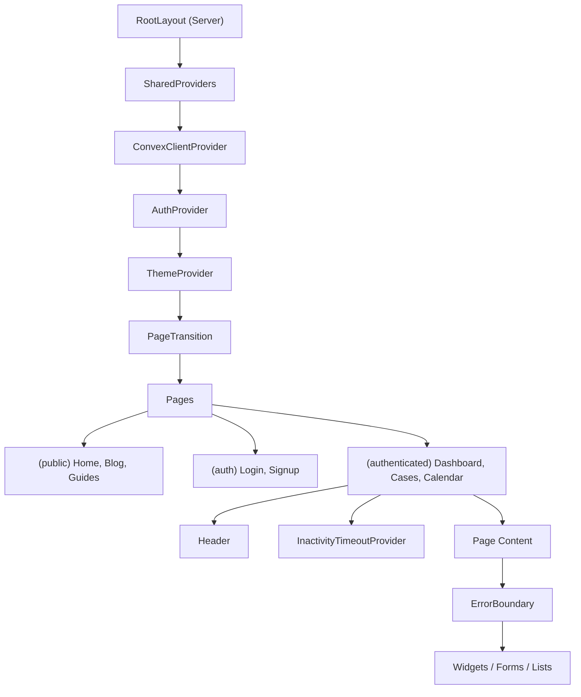

# Coding Conventions

**Analysis Date:** 2026-02-21

## TypeScript Configuration

**Strict Mode:** Enabled with extra strictness flags in `v2/tsconfig.json`:
- `strict: true`
- `noUncheckedIndexedAccess: true` — array indexing returns `T | undefined`
- `noImplicitOverride: true` — requires `override` keyword on class method overrides
- `target: ES2022`, `module: esnext`, `moduleResolution: bundler`

**Type vs Interface:** Use `interface` for component props and public API shapes. Use `type` for unions, intersections, and branded types.

```typescript
// Interface for props
interface SummaryTileProps {
  status: "pwd" | "recruitment" | "eta9089" | "i140" | "complete" | "closed";
  label: string;
  count: number;
}

// Type for unions and branded types
type CaseStatus = "pwd" | "recruitment" | "eta9089" | "i140" | "closed";
type ISODateString = string & { readonly __brand: "ISODateString" };
type AuthState = "idle" | "signingOut";
type ErrorSource = "mutation" | "action" | "cron" | "webhook";
```

**No `any`:** ESLint warns on `@typescript-eslint/no-explicit-any`. Test files have this rule disabled. Use `unknown` with narrowing instead. When `any` is unavoidable (Convex internal API type gaps), add `// eslint-disable-next-line @typescript-eslint/no-explicit-any` inline.

**Unused Variables:** Prefix with `_` (enforced by ESLint `argsIgnorePattern: "^_"`).

```typescript
const { children, initial: _initial, animate: _animate, ...domProps } = props;
```

## Naming Patterns

**Files:**
- React components: `PascalCase.tsx` (e.g., `SummaryTile.tsx`, `DeadlineHeroWidget.tsx`)
- Hooks: `camelCase.ts` with `use` prefix (e.g., `useDebounce.ts`, `useDerivedDates.ts`)
- Hooks (kebab variant): `kebab-case.ts` with `use-` prefix (e.g., `use-case-form-submit.ts`, `use-debounce.ts`) — both conventions exist, prefer camelCase for new hooks
- Utilities/lib: `camelCase.ts` (e.g., `errorRecording.ts`, `caseListHelpers.ts`)
- Constants: `camelCase.ts` (e.g., `navigation.ts`)
- Types: `camelCase.ts` with `Types` suffix (e.g., `dashboardTypes.ts`, `caseListTypes.ts`)
- Test files: `*.test.ts` or `*.test.tsx` co-located in `__tests__/` directories
- Stories: `*.stories.tsx` co-located with component
- Convex functions: `camelCase.ts` (e.g., `cases.ts`, `notifications.ts`, `deadlineEnforcement.ts`)

**Components:**
- PascalCase for component names matching filename
- Default exports for page-level components
- Named exports for reusable components and barrel exports

**Functions:**
- `camelCase` for all functions
- Prefix boolean returns with `is`, `has`, `should`, `can` (e.g., `isFirmAdmin`, `hasAnyCases`, `shouldSendEmail`, `isRecruitmentComplete`)
- Prefix getters with `get`, `calculate`, `extract`, `format` (e.g., `getCurrentUserId`, `calculatePWDExpiration`, `extractActiveDeadlines`, `formatRelativeTime`)
- Factory functions: `create` prefix (e.g., `createTestCase`, `createMockDeadlineItem`, `createLogger`)

**Variables:**
- `camelCase` for all variables
- `UPPER_SNAKE_CASE` for constants (e.g., `INPUT_LIMITS`, `FILING_WINDOW_WAIT_DAYS`, `STATUS_HEX_COLORS`)
- Type-only exports use `type` keyword: `export type { CaseStatus }`

**Indexes (Convex schema):**
- snake_case with `by_` prefix: `by_user_id`, `by_user_and_status`, `by_deleted_at`

**Tables (Convex schema):**
- camelCase: `cases`, `userProfiles`, `auditLogs`, `conversationMessages`

**CSS Classes:**
- Tailwind utility classes exclusively
- CSS variables for theme colors: `--tile-color`, `--font-heading`, `--stage-pwd`
- Custom utility classes in `globals.css`: `.grain-overlay`, `.prose-neobrutalist`
- Component-scoped styles via inline `style` prop with CSS variables

## Import Organization

**Order:**
1. React/Next.js framework imports
2. Third-party library imports
3. Internal `@/` aliased imports (components, lib, hooks)
4. Relative imports (siblings, types)

```typescript
// 1. Framework
import { query, mutation } from "./_generated/server";
import { v, ConvexError } from "convex/values";

// 2. Third-party
import { parseISO, format, addDays } from "date-fns";

// 3. Internal aliases
import { getCurrentUserId } from "./lib/auth";
import { validateCase, applyCascade } from "./lib/perm";
import { captureError } from "@/lib/sentry";

// 4. Relative
import type { Id } from "../_generated/dataModel";
import type { CaseData } from "./types";
```

**Path Aliases:**
- `@/*` maps to `./src/*` (defined in `v2/tsconfig.json`)
- `@/test-utils` maps to `./test-utils` (in vitest.config.ts only)
- `@/convex` maps to `./convex` (in vitest.config.ts only)

**Barrel Exports:** Used for key modules:
- `src/components/ui/index.ts` — all UI primitives
- `src/hooks/index.ts` — all custom hooks
- `convex/lib/perm/index.ts` — all PERM business logic
- `src/lib/perm/index.ts` — re-exports from `convex/lib/perm/`
- `test-utils/index.ts` — all test utilities

## React Patterns

### Component Structure

Components follow this pattern:

```typescript
"use client"; // Only when needed (hooks, event handlers, browser APIs)

import { ... } from "react";
import { ... } from "@/components/ui";
import { ... } from "@/lib/perm";

// Types at top
interface MyComponentProps {
  /** JSDoc on every prop */
  title: string;
  onAction?: () => void;
}

// Constants outside component
const STATUS_COLORS = { ... } as const;

// Helper components in same file (private)
function HelperComponent({ ... }: { ... }) {
  return <div>...</div>;
}

// Main component — default export for pages, named export for reusable
export default function MyComponent({ title, onAction }: MyComponentProps) {
  // Hooks first
  const router = useRouter();
  const [state, setState] = useState(initialValue);

  // Derived values
  const derivedValue = useMemo(() => ..., [deps]);

  // Event handlers
  const handleClick = useCallback(() => {
    onAction?.();
  }, [onAction]);

  // Early returns for loading/error
  if (!data) return <Skeleton />;

  // Render
  return (
    <div className="...tailwind classes...">
      {children}
    </div>
  );
}
```

### Page Pattern (Next.js App Router)

Server Component page exports metadata, delegates to Client Component:

```typescript
// v2/src/app/(authenticated)/dashboard/page.tsx
import type { Metadata } from "next";
import { DashboardPageClient } from "./DashboardPageClient";

export const metadata: Metadata = {
  title: "Dashboard",
  robots: { index: false, follow: false },
};

export default function DashboardPage() {
  return <DashboardPageClient />;
}
```

### Route Groups

- `(public)` — landing page, blog, guides (no auth)
- `(auth)` — login, signup pages
- `(authenticated)` — dashboard, cases, calendar, settings (requires auth)

### State Management

No global state library. State is managed via:
- **React Context** for cross-cutting concerns: `AuthContext` (sign-out state), `ThemeProvider` (next-themes)
- **Convex `useQuery`/`useMutation`** for server state (real-time)
- **React `useState`/`useReducer`** for local component state
- **URL search params** for filter/sort state (persisted in URL)
- **localStorage** for user preferences (filter persistence, dismissed banners)

### Error Boundaries

Class-based `ErrorBoundary` in `src/components/ui/error-boundary.tsx`:

```typescript
<ErrorBoundary
  fallback={<DashboardErrorFallback />}
  onError={(error) => captureError(error, { operation: "dashboard" })}
>
  <DashboardWidget />
</ErrorBoundary>
```

## Convex Patterns

### Function Types

```typescript
// Read-only queries
export const list = query({
  args: { status: v.optional(v.string()) },
  handler: async (ctx, args) => {
    const userId = await getCurrentUserIdOrNull(ctx); // Returns null for unauth
    if (!userId) return []; // Graceful degradation
    // ...
  },
});

// Write operations
export const create = mutation({
  args: { employerName: v.string(), ... },
  handler: async (ctx, args) => {
    const userId = await getCurrentUserId(ctx); // Throws if unauth
    // Validate input lengths
    validateInputLengths([
      { value: args.employerName, name: "employerName", limit: INPUT_LIMITS.SHORT },
    ]);
    // ...
  },
});

// Side effects (external APIs, email, etc.)
export const sendEmail = action({
  args: { ... },
  handler: async (ctx, args) => {
    const identity = await ctx.auth.getUserIdentity();
    if (!identity) throw new Error("not authenticated");
    const userId = extractUserIdFromAction(identity.subject);
    // ...
  },
});

// Server-only (called via `internal.*`)
export const processInternal = internalMutation({
  args: { ... },
  handler: async (ctx, args) => {
    // No auth check needed — only called from other server functions
  },
});
```

### Auth Guard Pattern

Two tiers of auth guards:

```typescript
// Strict (mutations, user-specific writes) — throws if not auth'd
const userId = await getCurrentUserId(ctx);

// Graceful (queries, read operations) — returns null/empty for unauth
const userId = await getCurrentUserIdOrNull(ctx);
if (!userId) return null; // or return []
```

### Ownership Verification

```typescript
const caseDoc = await ctx.db.get(args.id);
await verifyOwnership(ctx, caseDoc, "case"); // Throws if wrong user
```

### Soft Delete Pattern

All tables use `deletedAt` timestamp for soft deletes:

```typescript
// Filter out soft-deleted records
const cases = await ctx.db
  .query("cases")
  .withIndex("by_user_id", (q) => q.eq("userId", userId))
  .filter((q) => q.eq(q.field("deletedAt"), undefined))
  .collect();

// Soft delete
await ctx.db.patch(caseId, { deletedAt: Date.now() });
```

### Scheduled Functions

```typescript
// Schedule work for after the mutation completes
await ctx.scheduler.runAfter(0, internal.notifications.sendDeadlineEmail, {
  userId,
  caseId,
});
```

## Error Handling

### Frontend Pattern

```typescript
import { handleOperationError } from "@/lib/errors";
import { captureError } from "@/lib/sentry";

try {
  await updateCase(caseId, data);
} catch (error) {
  handleOperationError(error, {
    userMessage: "Failed to update case",
    context: { operation: "updateCase", resourceId: caseId },
  });
}
```

`handleOperationError` at `src/lib/errors.ts` combines:
1. Sentry capture via `captureError()`
2. User-facing toast notification via `toast.error()`

### Backend Pattern

```typescript
import { recordError } from "./lib/errorRecording";

try {
  await someOperation();
} catch (error) {
  console.error("Failed to do X", error);
  await recordError(ctx, "mutation", "cases.create.audit", error, {
    resourceId: caseId,
  });
}
```

`recordError` at `convex/lib/errorRecording.ts` schedules:
1. DB insert to `systemErrors` table + rate-limited admin email
2. Sentry HTTP API report via `sentryReportAction`

### Auth Error Handling

Auth errors (from `src/components/error/auth-error.ts`) redirect to `/login?expired=1`.

## Date Protocol

**ALL dates are ISO strings (YYYY-MM-DD).** Never store `Date` objects.

```typescript
import { parseISO, format, addDays } from "date-fns";

// Parse only for math, format back to string
const result = format(addDays(parseISO("2024-06-15"), 30), "yyyy-MM-dd");

// UTC-based date math in PERM logic
import { addDaysUTC, formatUTC, addBusinessDays } from "@/lib/perm";
```

**Branded type** for compile-time safety:

```typescript
type ISODateString = string & { readonly __brand: "ISODateString" };

function createISODate(dateStr: string): ISODateString {
  if (!isValidISODate(dateStr)) throw new Error("Invalid ISO date");
  return dateStr as ISODateString;
}
```

## Form Patterns

### Cascade System

Date fields auto-calculate dependent dates:

```typescript
import { applyCascade } from "@/lib/perm";

const handleDateChange = (field: string, value: string) => {
  // applyCascade returns new state with all downstream dates recalculated
  setFormData(applyCascade(formData, { field, value }));
};
```

### Validation on Save

```typescript
import { validateCase } from "@/lib/perm";

const result = validateCase(formData);
if (!result.valid) {
  setErrors(result.errors);
  return;
}
```

### Input Length Validation (Backend)

```typescript
import { validateInputLengths, INPUT_LIMITS } from "./lib/validation";

validateInputLengths([
  { value: args.employerName, name: "employerName", limit: INPUT_LIMITS.SHORT },    // 500 chars
  { value: args.notes, name: "notes", limit: INPUT_LIMITS.MEDIUM },                  // 10,000 chars
  { value: args.jobDescription, name: "jobDescription", limit: INPUT_LIMITS.LONG },  // 50,000 chars
]);
```

## Logging

### Backend (Convex)

```typescript
import { createLogger } from "./lib/logging";
const log = createLogger("GoogleCalendar");

log.info("Token refreshed", { userId });
log.error("Failed to create event", { error, caseId });
```

Pre-built loggers at `convex/lib/logging.ts`:

```typescript
import { loggers } from "./lib/logging";
const log = loggers.cases; // Pre-configured for cases module
```

### Frontend

```typescript
import { captureError, addBreadcrumb } from "@/lib/sentry";

addBreadcrumb({ category: "ui.click", message: "Save Case" });
captureError(error, { operation: "updateCase", resourceId: caseId });
```

## CSS / Styling

**Framework:** Tailwind CSS v4 with `tw-animate-css`.

**Design System:** Neobrutalist aesthetic with:
- Hard shadows: `shadow-hard` (`4px 4px 0px #000`)
- Thick borders: `border-3 border-black dark:border-white/20`
- Bold typography: Space Grotesk (headings), Inter (body), JetBrains Mono (code)
- Stage colors as CSS variables: `--stage-pwd`, `--stage-recruitment`, etc.

**Component Library:** shadcn/ui (New York style) via `v2/components.json`:
- Config: `v2/components.json`
- CSS variables: `src/app/globals.css`
- Components: `src/components/ui/`

**Dark Mode:** `next-themes` with `class` attribute strategy.

**Animation:** `motion` (Framer Motion) for page transitions, scroll reveals, and micro-interactions.

## Comments

**JSDoc on:**
- All exported functions with `@example` blocks
- All interface/type definitions
- Module-level `@module` tags on index files

**Section Headers:** Use comment blocks with `=====` dividers:

```typescript
// ============================================================================
// TYPES
// ============================================================================
```

**Inline Comments:** Explain "why", not "what". Required for:
- Non-obvious workarounds (SWC minifier bugs, Convex limitations)
- Business logic rationale (regulatory references like "20 CFR 656.40")
- Known limitations

## Module Design

**Exports:** Named exports preferred. Default exports only for page components.

**Single Source of Truth:** Business logic lives in one canonical location:
- PERM logic: `convex/lib/perm/` (backend canonical), `src/lib/perm/` (frontend re-export)
- Auth helpers: `convex/lib/auth.ts`
- Error recording: `convex/lib/errorRecording.ts`
- Navigation constants: `src/lib/constants/navigation.ts`

## Anti-Patterns

**Never recreate PERM logic:**
```typescript
// WRONG
const expiration = addDays(determinationDate, 365);

// RIGHT
import { calculatePWDExpiration } from "@/lib/perm";
const expiration = calculatePWDExpiration(determinationDate);
```

**Never hardcode validation rules:**
```typescript
// WRONG
if (filingDate > certDate + 180) { ... }

// RIGHT
import { validateI140 } from "@/lib/perm";
const result = validateI140(caseData);
```

**Never use `??` in dense expressions (SWC minifier bug):**
```typescript
// WRONG — SWC drops variable declarations with ~20+ ?? chains
const value = a ?? b ?? c ?? d ?? e;

// RIGHT — use || or ternary
const value = a || b || c || d || e;
```

**Never store Date objects:**
```typescript
// WRONG
const date = new Date();
await ctx.db.patch(id, { pwdFilingDate: date });

// RIGHT
const date = format(new Date(), "yyyy-MM-dd");
await ctx.db.patch(id, { pwdFilingDate: date });
```

**Never use `toast` from "sonner" directly:**
```typescript
// WRONG — not auth-aware
import { toast } from "sonner";

// RIGHT — suppresses during sign-out
import { toast } from "@/lib/toast";
```

## Component Hierarchy



---

*Convention analysis: 2026-02-21*
