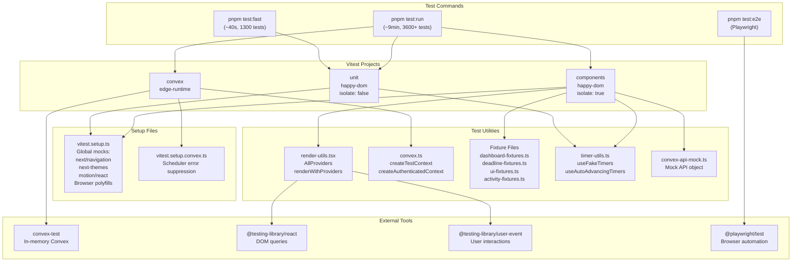

# Testing Patterns

**Analysis Date:** 2026-02-21

## Test Framework

**Runner:**
- Vitest 4.0.18 (unit/component/integration)
- Playwright 1.58.2 (E2E)
- Config: `v2/vitest.config.ts`, `v2/playwright.config.ts`

**Assertion Library:**
- Vitest built-in (`expect`)
- `@testing-library/jest-dom` matchers (`.toBeInTheDocument()`, `.toHaveAttribute()`, etc.)
- `vitest-axe` for accessibility assertions

**DOM Environment:**
- `happy-dom` (default for unit and component tests — faster than jsdom)
- `edge-runtime` (Convex integration tests via `@edge-runtime/vm`)

**React Testing:**
- `@testing-library/react` 16.3.2
- `@testing-library/user-event` 14.6.1

**Run Commands:**
```bash
pnpm test              # Watch mode (re-tests on save)
pnpm test:run          # Full suite (~9 min, 3600+ tests)
pnpm test:fast         # Unit + PERM tests (~40s, ~1300 tests)
pnpm test:unit         # src/lib and src/hooks tests
pnpm test:components   # Component tests only
pnpm test:convex       # Convex integration tests only
pnpm test:perm         # PERM calculators/validators only
pnpm test:changed      # Files changed since last commit
pnpm test:coverage     # Full coverage report (v8 provider)
pnpm test:ci           # CI mode (JSON + GitHub Actions reporters)
pnpm test:e2e          # Playwright E2E (starts servers automatically)
pnpm test:all          # Unit + E2E combined
```

## Test File Organization

**Location:** Co-located `__tests__/` directories next to source code.

**Naming:**
- Unit/Component tests: `*.test.ts` or `*.test.tsx`
- E2E tests: `*.spec.ts` (in `v2/tests/e2e/`)
- Stories: `*.stories.tsx` (co-located with component)

**Structure:**
```
v2/
├── convex/
│   ├── cases.test.ts                         # Convex integration test
│   ├── notifications.test.ts                 # Convex integration test
│   ├── dashboard.test.ts                     # Convex integration test
│   ├── calendar.test.ts                      # Convex integration test
│   ├── timeline.test.ts                      # Convex integration test
│   ├── users.test.ts                         # Convex integration test
│   ├── onboarding.test.ts                    # Convex integration test
│   ├── cases-onboarding.test.ts              # Convex integration test
│   ├── __tests__/
│   │   ├── apiUsage.test.ts                  # API usage tracking
│   │   ├── conversations.test.ts             # Chat conversations
│   │   ├── conversationMessages.test.ts      # Chat messages
│   │   ├── chatCaseData.test.ts              # Chat case data extraction
│   │   ├── knowledge.test.ts                 # RAG knowledge base
│   │   ├── webSearch.test.ts                 # Web search integration
│   │   ├── scheduledJobs.test.ts             # Cron/scheduled jobs
│   │   ├── systemErrors.test.ts              # Error recording
│   ├── lib/
│   │   ├── __tests__/
│   │   │   ├── admin.test.ts                 # Admin guard functions
│   │   │   ├── calendarEventExtractor.test.ts # Calendar event extraction
│   │   │   ├── calendarHelpers.test.ts       # Calendar utilities
│   │   │   ├── crypto.test.ts                # Encryption utilities
│   │   │   ├── dashboardHelpers.test.ts      # Dashboard data helpers
│   │   │   ├── dataExport.test.ts            # Data export logic
│   │   │   ├── dateValidation.test.ts        # Date validation
│   │   │   ├── deadlineEnforcementHelpers.test.ts # Deadline enforcement
│   │   │   ├── errorRecording.test.ts        # Error recording pipeline
│   │   │   ├── rateLimit.test.ts             # Rate limiting
│   │   │   ├── validation.test.ts            # Input validation
│   │   ├── caseListHelpers.test.ts           # Case list filtering/sorting
│   │   ├── caseListTypes.test.ts             # Case list type guards
│   │   ├── dashboard.test.ts                 # Dashboard queries
│   │   ├── derivedCalculations.test.ts       # Derived date calculations
│   │   ├── perm/
│   │   │   ├── calculators/
│   │   │   │   ├── pwd.test.ts               # PWD expiration calculator
│   │   │   │   ├── eta9089.test.ts           # ETA 9089 calculator
│   │   │   │   ├── recruitment.test.ts       # Recruitment deadline calculator
│   │   │   │   ├── i140.test.ts              # I-140 filing deadline calculator
│   │   │   │   └── rfi.test.ts               # RFI due date calculator
│   │   │   ├── validators/
│   │   │   │   ├── pwd.test.ts               # PWD validation rules
│   │   │   │   ├── eta9089.test.ts           # ETA 9089 validation
│   │   │   │   ├── recruitment.test.ts       # Recruitment validation
│   │   │   │   ├── i140.test.ts              # I-140 validation
│   │   │   │   ├── rfi.test.ts               # RFI validation
│   │   │   │   ├── rfe.test.ts               # RFE validation
│   │   │   │   ├── validateCase.test.ts      # Master case validator
│   │   │   │   └── __tests__/
│   │   │   │       └── professionalRecruitment.test.ts # Professional methods
│   │   │   ├── dates/
│   │   │   │   ├── holidays.test.ts          # Federal holiday calculations
│   │   │   │   ├── filingWindow.test.ts      # Filing window calculations
│   │   │   │   └── __tests__/
│   │   │   │       ├── businessDays.test.ts  # Business day calculations
│   │   │   │       ├── filingWindow.test.ts  # Filing window edge cases
│   │   │   │       └── dateUtils.test.ts     # Date utility functions
│   │   │   ├── cascade.test.ts               # Cascade auto-calculations
│   │   │   ├── statusCalculation.test.ts     # Status auto-calculation
│   │   │   ├── recruitment/
│   │   │   │   └── __tests__/
│   │   │   │       └── isRecruitmentComplete.test.ts # Recruitment completeness
│   │   │   ├── deadlines/
│   │   │   │   ├── isDeadlineActive.test.ts  # Deadline supersession
│   │   │   │   ├── extractActiveDeadlines.test.ts # Active deadline extraction
│   │   │   │   └── timezones.test.ts         # Timezone rules
│   │   │   └── utils/
│   │   │       └── __tests__/
│   │   │           ├── fieldMapper.test.ts   # snake_case/camelCase mapping
│   │   │           └── validation.test.ts    # Validation utilities
├── src/
│   ├── lib/
│   │   ├── __tests__/
│   │   │   ├── toast.test.ts                 # Auth-aware toast wrapper
│   │   │   └── errors.test.ts                # Error handling utilities
│   │   ├── utils/__tests__/
│   │   │   └── date.test.ts                  # Date formatting utilities
│   │   ├── ai/__tests__/
│   │   │   ├── tools.test.ts                 # AI chat tool definitions
│   │   │   ├── tool-confirmation-types.test.ts # Tool confirmation types
│   │   │   ├── providers.test.ts             # AI provider configuration
│   │   │   └── page-context.test.tsx         # Page context for AI (FLAKY)
│   │   ├── auth/__tests__/
│   │   │   └── termsStorage.test.ts          # Terms acceptance storage
│   │   ├── content/__tests__/
│   │   │   ├── index.test.ts                 # MDX content processing
│   │   │   └── seo.test.ts                   # SEO metadata generation
│   │   ├── contexts/__tests__/
│   │   │   └── AuthContext.test.tsx           # Auth state management
│   │   ├── demo/__tests__/
│   │   │   └── storage.test.ts               # Demo data storage
│   │   ├── export/__tests__/
│   │   │   └── caseExport.test.ts            # Case CSV/JSON export
│   │   ├── forms/__tests__/
│   │   │   ├── case-form-schema.test.ts      # Form validation schema
│   │   │   ├── date-constraints.test.ts      # Date field constraints
│   │   │   ├── prepareUpdatePayload.test.ts  # Update payload prep
│   │   │   └── strip-and-labels.test.ts      # Field stripping/labels
│   │   ├── google/__tests__/
│   │   │   └── oauth.test.ts                 # Google OAuth utilities
│   │   ├── hooks/__tests__/
│   │   │   └── useInactivityTimeout.test.ts  # Inactivity timeout (104 tests)
│   │   ├── import/__tests__/
│   │   │   └── caseImport.test.ts            # Case CSV import
│   │   ├── recruitment/__tests__/
│   │   │   ├── resultsGenerator.test.ts      # Recruitment results
│   │   │   └── statusCalculator.test.ts      # Recruitment status
│   │   ├── timeline/__tests__/
│   │   │   └── milestones.test.ts            # Timeline milestones
│   │   └── calendar/
│   │       └── event-mapper.test.ts          # Calendar event mapping
│   ├── hooks/__tests__/
│   │   ├── useDerivedDates.test.ts           # Derived date calculations
│   │   ├── use-debounce.test.ts              # Debounce hook
│   │   ├── use-case-form-submit.test.ts      # Form submission hook
│   │   ├── useChatWithPersistence.test.ts    # Chat persistence hook
│   │   ├── useDateFieldValidation.test.ts    # Date field validation hook
│   │   ├── useFormCalculations.test.ts       # Form calculations hook
│   │   ├── useJobDescriptionTemplates.test.ts # Job description hook
│   │   ├── useSectionState.test.ts           # Section collapse state
│   │   ├── useToolConfirmations.test.ts      # AI tool confirmations
│   │   └── useToolOrchestrator.test.ts       # AI tool orchestration
│   ├── components/
│   │   ├── dashboard/__tests__/
│   │   │   ├── AddCaseButton.test.tsx
│   │   │   ├── DeadlineHeroWidget.test.tsx
│   │   │   ├── DeadlineItem.test.tsx
│   │   │   ├── RecentActivityCard.test.tsx
│   │   │   ├── RecentActivityWidget.test.tsx
│   │   │   ├── SummaryTile.test.tsx
│   │   │   ├── SummaryTilesGrid.test.tsx
│   │   │   ├── UpcomingDeadlineItem.test.tsx
│   │   │   ├── UpcomingDeadlinesWidget.test.tsx
│   │   │   └── UrgencyGroup.test.tsx
│   │   ├── forms/__tests__/
│   │   │   ├── CaseForm.test.tsx
│   │   │   ├── DateInput.test.tsx
│   │   │   ├── FormField.test.tsx
│   │   │   └── case-form.helpers.test.ts
│   │   ├── forms/sections/__tests__/
│   │   │   ├── BasicInfoSection.test.tsx
│   │   │   ├── PWDSection.test.tsx
│   │   │   ├── ETA9089Section.test.tsx
│   │   │   ├── I140Section.test.tsx
│   │   │   ├── RecruitmentSection.test.tsx
│   │   │   ├── RFIEntry.test.tsx
│   │   │   └── RFEEntry.test.tsx
│   │   ├── cases/__tests__/
│   │   │   ├── CaseCard.test.tsx
│   │   │   ├── CasePagination.test.tsx
│   │   │   ├── ImportModal.test.tsx
│   │   │   └── SelectionBar.test.tsx
│   │   ├── cases/detail/__tests__/
│   │   │   ├── InlineCaseTimeline.test.tsx
│   │   │   └── WindowsDisplay.test.tsx
│   │   ├── chat/__tests__/
│   │   │   ├── ChatInput.test.tsx
│   │   │   └── ChatMessage.test.tsx
│   │   ├── layout/__tests__/
│   │   │   ├── AuthFooter.test.tsx
│   │   │   ├── AuthHeader.test.tsx
│   │   │   ├── DeletionBanner.test.tsx
│   │   │   ├── Header.test.tsx
│   │   │   ├── InactivityTimeoutProvider.test.tsx
│   │   │   ├── SignOutOverlay.test.tsx
│   │   │   └── TimeoutWarningModal.test.tsx
│   │   ├── notifications/__tests__/
│   │   │   ├── BulkActions.test.tsx
│   │   │   ├── NotificationList.test.tsx
│   │   │   └── NotificationTabs.test.tsx
│   │   ├── settings/__tests__/
│   │   │   ├── CalendarSyncSection.test.tsx
│   │   │   ├── DeleteNowDialog.test.tsx
│   │   │   ├── NotificationPreferencesSection.test.tsx
│   │   │   ├── ProfileSection.test.tsx
│   │   │   ├── QuietHoursSection.test.tsx
│   │   │   └── SupportSection.test.tsx
│   │   ├── timeline/__tests__/
│   │   │   ├── CaseSelectionModal.test.tsx
│   │   │   ├── TimelineGrid.test.tsx
│   │   │   ├── TimelineMilestoneMarker.test.tsx
│   │   │   └── useCaseSelection.test.ts
│   │   ├── error/__tests__/
│   │   │   └── RouteError.test.tsx
│   │   ├── empty-states/__tests__/
│   │   │   └── NoCasesYet.test.tsx
│   │   └── job-description/__tests__/
│   │       └── JobDescriptionField.test.tsx
│   ├── emails/__tests__/
│   │   ├── templates.test.tsx                # Email template rendering
│   │   └── components.test.tsx               # Shared email components
│   └── app/
│       └── (authenticated)/
│           ├── cases/new/__tests__/page.test.tsx
│           ├── cases/[id]/__tests__/page.test.tsx
│           ├── cases/[id]/edit/__tests__/page.test.tsx
│           └── timeline/__tests__/page.test.tsx
├── test-utils/
│   ├── jobDescriptionTemplates.test.ts       # Template CRUD integration test
│   └── (fixture/helper files — see below)
├── tests/
│   └── e2e/
│       └── connection.spec.ts                # E2E: Convex connection verify
```

**Total test files:** 92 frontend + 57 Convex + 1 test-utils + 1 E2E = **151 test files**

## Vitest Project Structure

Three-tier configuration in `v2/vitest.config.ts`:

| Project | Environment | Includes | Timeout | Isolation |
|---------|-------------|----------|---------|-----------|
| `unit` | `happy-dom` | `src/lib/**`, `src/hooks/**`, `convex/lib/perm/**`, `convex/lib/*.test.ts` | 5s | `false` (shared for speed) |
| `components` | `happy-dom` | `src/components/**`, `src/app/**`, `src/emails/**`, `test-utils/**` | 10s | `true` (clean DOM state) |
| `convex` | `edge-runtime` | `convex/*.test.ts`, `convex/__tests__/**`, `convex/lib/__tests__/**` | 15s | default |

**Global settings:**
- `pool: "threads"` (shared memory, faster than forks)
- `bail: 1` locally, `bail: 5` in CI
- `sequence.shuffle: true` in CI only (detect order dependencies)
- `passWithNoTests: true`

## Test Structure

### Unit Test Pattern (Pure Functions)

```typescript
import { describe, it, expect } from "vitest";
import { calculatePWDExpiration } from "./pwd";

describe("calculatePWDExpiration", () => {
  describe("Case 1: April 2 - June 30 (determination + 90 days)", () => {
    it("should calculate May 15 -> Aug 13", () => {
      expect(calculatePWDExpiration("2024-05-15")).toBe("2024-08-13");
    });
  });

  describe("Leap year handling", () => {
    it("should handle Feb 29 correctly", () => {
      expect(calculatePWDExpiration("2024-02-29")).toBe("2024-06-30");
    });
  });
});
```

### Component Test Pattern

```typescript
// @vitest-environment jsdom  (optional: override when needed)
import { describe, it, expect } from "vitest";
import { screen } from "@testing-library/react";
import { renderWithProviders } from "@/test-utils/render-utils";
import SummaryTile from "../SummaryTile";

const defaultProps = {
  status: "pwd" as const,
  label: "PWD",
  count: 5,
  subtext: "3 working, 2 filed",
  href: "/cases?status=pwd",
};

describe("SummaryTile", () => {
  it("renders label, count, subtext, and links to filtered cases", () => {
    renderWithProviders(<SummaryTile {...defaultProps} />);

    expect(screen.getByText("PWD")).toBeInTheDocument();
    expect(screen.getByText("5")).toBeInTheDocument();
    expect(screen.getByRole("link")).toHaveAttribute("href", "/cases?status=pwd");
  });
});
```

### Convex Integration Test Pattern

```typescript
import { describe, it, expect } from "vitest";
import {
  createTestContext,
  createAuthenticatedContext,
  setupSchedulerTests,
  finishScheduledFunctions,
} from "../test-utils/convex";
import { api } from "./_generated/api";

describe("Cases Security", () => {
  setupSchedulerTests(); // Enable fake timers for scheduled functions

  describe("Authentication", () => {
    it("should reject unauthenticated create mutation", async () => {
      const t = createTestContext();
      await expect(
        t.mutation(api.cases.create, { employerName: "Test", ... })
      ).rejects.toThrow();
    });
  });

  describe("User Isolation", () => {
    it("should not return other user's cases", async () => {
      const t = createTestContext();
      const userA = await createAuthenticatedContext(t, "User A");
      await userA.mutation(api.cases.create, { ... });
      await finishScheduledFunctions(t);

      const userB = await createAuthenticatedContext(t, "User B");
      const cases = await userB.query(api.cases.list, {});
      expect(cases).toHaveLength(0);
    });
  });
});
```

### Hook Test Pattern

```typescript
import { describe, it, expect, vi } from "vitest";
import { renderHook, act } from "@testing-library/react";
import { useInactivityTimeout } from "../useInactivityTimeout";

describe("useInactivityTimeout", () => {
  beforeEach(() => {
    vi.useFakeTimers();
    // Mock browser APIs (localStorage, BroadcastChannel)
  });

  afterEach(() => {
    vi.useRealTimers();
  });

  it("returns isWarningVisible as false initially", () => {
    const onTimeout = vi.fn();
    const { result } = renderHook(() =>
      useInactivityTimeout({ onTimeout })
    );
    expect(result.current.isWarningVisible).toBe(false);
  });
});
```

### E2E Test Pattern (Playwright)

```typescript
import { test, expect } from "@playwright/test";

test.describe("Convex Connection", () => {
  test("homepage loads and shows connection", async ({ page }) => {
    await page.goto("/");
    await expect(page.getByRole("heading", { name: "..." })).toBeVisible();
    await expect(page.getByText("Convex connection verified")).toBeVisible({
      timeout: 10000,
    });
  });
});
```

## Setup Files

### `v2/vitest.setup.ts` (Unit + Component tests)

Provides global mocks and polyfills:

| Mock | Why |
|------|-----|
| `next/navigation` | `useRouter`, `usePathname`, `useSearchParams` — no App Router in tests |
| `next-themes` | `ThemeProvider` + `useTheme` — avoids `<script>` injection in DOM |
| `motion/react` | Motion components → plain DOM elements (no browser animation APIs) |
| `window.matchMedia` | Polyfill for dark mode detection |
| `ResizeObserver` | Polyfill for layout-aware components |
| `Element.scrollIntoView` | Polyfill for form scroll behavior |
| `Blob.prototype.text` | Polyfill for JSDOM |

### `v2/vitest.setup.convex.ts` (Convex integration tests)

Suppresses known `convex-test` limitations:
- `"Write outside of transaction"` errors from scheduled functions running after test transaction closes
- Custom `process.on("unhandledRejection")` handler

## Test Utilities Inventory

All test utilities in `v2/test-utils/`, barrel-exported from `v2/test-utils/index.ts`:

### `render-utils.tsx` — React rendering helpers

| Export | Purpose |
|--------|---------|
| `AllProviders` | Wraps children in `AuthProvider` + `ThemeProvider` |
| `renderWithProviders(ui, options?)` | Custom `render()` with all providers + `userEvent.setup()` |
| `mockUsePathname(path)` | Factory for mocking `usePathname` |
| `mockUseRouter(overrides?)` | Factory for mocking `useRouter` |
| `mockUseQuery(data, isLoading?)` | Factory for mocking Convex `useQuery` |
| `mockUseMutation(fn)` | Factory for mocking Convex `useMutation` |
| `waitForAsync(ms?)` | Wait for async state updates |
| `renderLoadingState(ui)` | Render with loading state (query returns undefined) |
| `suppressConsoleError(callback)` | Suppress expected console.error during test |

### `convex.ts` — Convex function testing

| Export | Purpose |
|--------|---------|
| `createTestContext()` | Creates clean `convex-test` context with schema + modules |
| `createAuthenticatedContext(t, name?)` | Creates user in DB + returns authenticated context with `ctx` and `userId` |
| `setupSchedulerTests()` | `beforeEach`/`afterEach` for fake timers (required for scheduled functions) |
| `finishScheduledFunctions(t)` | Advances timers to complete all scheduled work |
| `withScheduler(t, mutationFn)` | Higher-order wrapper: run mutation + finish scheduled |
| `advanceTime(ms)` | Advance fake timer by milliseconds |
| `fixtures.testItem(overrides?)` | Basic test data factory |

### `convex-api-mock.ts` — Mock Convex API

Provides `api` object matching Convex generated API structure for component tests that import `api` but don't need real backend.

### `dashboard-fixtures.ts` — Case data factories

| Export | Purpose |
|--------|---------|
| `createTestCase(overrides?)` | Factory for `TestCaseData` with all PERM fields |
| `pwdFixtures` | PWD stage scenarios (working, filed, expiring) |
| `recruitmentFixtures` | Recruitment scenarios (active, complete) |
| `eta9089Fixtures` | ETA 9089 scenarios (pending, RFI, certified) |
| `i140Fixtures` | I-140 scenarios (pending, RFE, approved) |
| `specialFixtures` | Edge cases (closed, overdue deadline) |
| `formatISO()`, `today()`, `daysFromNow()`, `daysAgo()` | UTC date helpers |
| `lastSundayBeforeDaysAgo()` | Sunday ad date helper |

### `deadline-fixtures.ts` — Deadline widget factories

| Export | Purpose |
|--------|---------|
| `createMockDeadlineItem(overrides?)` | Factory for `DeadlineItem` |
| `createOverdueDeadline()` | Overdue deadline factory |
| `createThisWeekDeadline()` | This week deadline factory |
| `createThisMonthDeadline()` | This month deadline factory |
| `createLaterDeadline()` | Later deadline factory |
| `createMockDeadlineGroups()` | Full `DeadlineGroups` factory |
| `createEmptyDeadlineGroups()` | Empty groups factory |
| `createManyDeadlinesGroup(count, urgency)` | Bulk factory for overflow testing |
| `URGENCY_STYLES` | Expected Tailwind classes per urgency level |
| `deadlineScenarios` | Preset scenarios (empty, single overdue, balanced, high volume) |

### `ui-fixtures.ts` — UI and dashboard factories

| Export | Purpose |
|--------|---------|
| `createMockDashboardSummary(overrides?)` | Dashboard summary with stage counts |
| `createMockUser(overrides?)` | Mock authenticated user |
| `NAV_LINKS` | Authenticated navigation links |
| `AUTH_NAV_LINKS` | Public navigation links |
| `STATUS_COLORS` | Case status hex/CSS values |
| `URGENCY_COLORS` | Urgency level hex/CSS values |
| `TAG_COLORS` | Tag color values |
| `dashboardScenarios` | Preset scenarios (empty, minimal, balanced, high volume) |

### `activity-fixtures.ts` — Activity feed factories

| Export | Purpose |
|--------|---------|
| `createMockActivityItem()` | Recent activity item factory |
| `createMockActivityList()` | Activity list factory |
| `createMockUpcomingDeadline()` | Upcoming deadline factory |
| `createMockUpcomingDeadlines()` | Multiple deadlines factory |
| `ACTIVITY_ACTIONS` | Activity action type constants |
| `now()`, `minutesAgo()`, `hoursAgo()`, `daysAgo()` | Timestamp helpers |

### `timer-utils.ts` — Fake timer management

| Export | Purpose |
|--------|---------|
| `useFakeTimers(options?)` | Setup fake timers with `beforeEach`/`afterEach` cleanup |
| `useAutoAdvancingTimers(initialDate?)` | Fake timers with `shouldAdvanceTime: true` (userEvent compat) |
| `useFakeTimersWithDate(date)` | Fake timers with fixed system date |
| `setupFakeTimersOnce(date?, options?)` | One-off timer setup with manual `cleanup()` |

Returns `TimerControls`: `advanceTime`, `setSystemTime`, `runAllTimers`, `getTimerCount`, etc.

## Mocking Patterns

### Convex Hooks (Component Tests)

```typescript
import { vi } from "vitest";

// Mock useQuery — return test data
vi.mock("convex/react", () => ({
  useQuery: () => mockDashboardData,
  useMutation: () => vi.fn(),
  useAction: () => vi.fn(),
}));
```

### Next.js Navigation

Globally mocked in `vitest.setup.ts`. Override per-test:

```typescript
vi.mock("next/navigation", () => ({
  useRouter: () => ({ push: pushMock }),
  usePathname: () => "/dashboard",
  useSearchParams: () => new URLSearchParams("?status=pwd"),
}));
```

### Browser APIs

```typescript
// localStorage
const localStorageMock = {
  getItem: vi.fn(() => null),
  setItem: vi.fn(),
  removeItem: vi.fn(),
};
Object.defineProperty(window, "localStorage", { value: localStorageMock });

// BroadcastChannel
vi.stubGlobal("BroadcastChannel", class {
  onmessage = null;
  postMessage = vi.fn();
  close = vi.fn();
});
```

### Convex Integration (convex-test)

```typescript
import { convexTest } from "convex-test";
import schema from "../convex/schema";

// Load all modules via Vite glob
const modules = import.meta.glob("../convex/**/*.ts");

// Create isolated test context
const t = convexTest(schema, modules);

// Authenticate with real DB user
const { ctx: user, userId } = await createAuthenticatedContext(t);

// Run queries/mutations
const result = await user.query(api.cases.list, {});
await user.mutation(api.cases.create, { ... });

// Handle scheduled functions
await finishScheduledFunctions(t); // or: await t.finishAllScheduledFunctions(vi.runAllTimers);
```

### Direct DB Operations in Tests

```typescript
// Insert test data directly (bypass mutation validation)
await user.run(async (ctx) => {
  await ctx.db.insert("notifications", {
    userId,
    type: "deadline_reminder",
    title: "Test",
    message: "Message",
    priority: "normal",
    isRead: false,
    emailSent: false,
    createdAt: Date.now(),
    updatedAt: Date.now(),
  });
});
```

### Email Template Testing

```typescript
import { render } from "@react-email/render";
import { DeadlineReminder } from "../DeadlineReminder";

it("renders without errors", async () => {
  const html = await render(DeadlineReminder(baseProps));
  expect(html).toBeDefined();
  expect(html).toContain("Acme Corp");
});
```

## Coverage

**Provider:** V8 (`@vitest/coverage-v8`)

**CI Thresholds:**
- Branches: 70%
- Functions: 75%
- Lines: 75%
- Statements: 75%

**Reporters:** `text`, `html`, `lcov`, `json-summary`
**Reports Directory:** `v2/coverage/`

**Included:** `src/**/*.{ts,tsx}`, `convex/**/*.ts`
**Excluded:** `**/__tests__/**`, `**/test-utils/**`, `src/**/*.d.ts`, `convex/_generated/**`, `**/*.stories.*`

**View Coverage:**
```bash
pnpm test:coverage           # Generate coverage report
open coverage/index.html     # View HTML report
```

## Test Types

### Unit Tests (~1300 in fast suite)
- **Scope:** Pure functions, utilities, calculators, validators
- **Location:** `convex/lib/perm/**/*.test.ts`, `src/lib/**/*.test.ts`, `src/hooks/**/*.test.ts`
- **Environment:** `happy-dom`
- **Speed:** Very fast (no isolation, shared environment)
- **Pattern:** Direct function import and assertion

### Component Tests (~2300 additional)
- **Scope:** React components, form sections, dashboard widgets, email templates
- **Location:** `src/components/**/__tests__/*.test.tsx`, `src/app/**/__tests__/*.test.tsx`
- **Environment:** `happy-dom`
- **Speed:** Moderate (isolated for clean DOM state)
- **Pattern:** `renderWithProviders()` + Testing Library queries

### Convex Integration Tests
- **Scope:** Full Convex function testing with real schema, auth, and scheduled functions
- **Location:** `convex/*.test.ts`, `convex/__tests__/*.test.ts`, `convex/lib/__tests__/*.test.ts`
- **Environment:** `edge-runtime`
- **Speed:** Slower (real DB operations via convex-test)
- **Pattern:** `createTestContext()` + `createAuthenticatedContext()` + real API calls

### E2E Tests (Playwright)
- **Scope:** Full browser testing against running dev servers
- **Location:** `v2/tests/e2e/*.spec.ts`
- **Framework:** Playwright with Chromium
- **Speed:** Slow (requires both Convex dev + Next.js dev servers)
- **Runner:** `v2/run-e2e-tests.sh` (starts servers, runs tests, cleans up)
- **CI Config:** 2 retries, 1 worker, HTML reporter

## Flaky Tests and Known Issues

| Test | Issue | Workaround |
|------|-------|------------|
| `src/lib/__tests__/toast.test.ts` | Fails when run with other tests | Passes in isolation |
| `src/lib/ai/__tests__/page-context.test.tsx` | Fails when run with other tests | Passes in isolation |
| Convex tests with `ctx.scheduler.runAfter()` | "Write outside of transaction" | Suppressed in `vitest.setup.convex.ts` |

## Test Factories and Helpers

### Factory Pattern

All factories follow the same pattern: sensible defaults + partial overrides:

```typescript
export function createTestCase(overrides: Partial<TestCaseData> = {}): TestCaseData {
  const baseCase: TestCaseData = {
    employerName: "Test Company Inc.",
    caseStatus: "pwd",
    progressStatus: "working",
    // ... all fields with defaults
  };
  return { ...baseCase, ...overrides };
}
```

### Scenario Presets

Factories include pre-built scenarios for common test cases:

```typescript
export const dashboardScenarios = {
  empty: createMockDashboardSummary({ ... }),     // New user
  minimal: createMockDashboardSummary({ ... }),   // 1 case
  balanced: createMockDashboardSummary({ ... }),  // Realistic mix
  highVolume: createMockDashboardSummary({ ... }),// Busy firm
};
```

### Inline Test Factories

For Convex integration tests, factory functions are defined inline in the test file:

```typescript
async function createTestTemplate(
  auth: Awaited<ReturnType<typeof createAuthenticatedContext>>,
  overrides: TemplateData = {}
): Promise<Id<"jobDescriptionTemplates">> {
  return auth.run(async (ctx) => {
    return await ctx.db.insert("jobDescriptionTemplates", {
      userId: auth.userId,
      name: overrides.name ?? "Test Template",
      // ...
    });
  });
}
```

## Test Infrastructure Layers



---

*Testing analysis: 2026-02-21*
