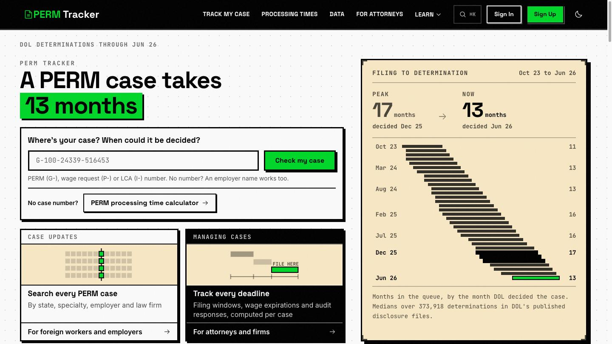

# PERM Tracker

**Federal labor-certification data, read from the source, for the people waiting on a case and the attorneys filing them.**


**Live:** https://permtracker.app



---

## What this is

Two products sharing one corpus.

**The public side** answers the question most people arrive with: *where is my case, and when is it likely to move?* Anyone can look up a case number across all three Department of Labor programs, search by employer, law firm, worksite state or occupation, and read what DOL has published about wages, queue position and decision activity. No account required.

**The application** is case management for immigration attorneys: deadline calculation under 20 CFR 656.40, cascade logic, recruitment windows, notifications and calendar sync.

The public side isn't marketing for the app. It's the larger half by traffic and by page count, and it's what the data pipeline exists to serve.

---

## Where the data comes from

Every dataset has a first-party source of record. There are **zero live third-party data dependencies**.

| Dataset | Source | Cadence |
|---|---|---|
| Per-case status, all three programs | DOL `flag.dol.gov` batch API | Daily full sweep + daily pending sweep |
| New filings | DOL, found by a nightly serial prober and by visitor lookups | Nightly; lookups instant |
| Decided cases, wages, worksites | DOL quarterly disclosure files | Quarterly, checked monthly |
| Processing times | DOL FLAG | Daily |
| Visa bulletin | US State Department | Monthly |
| I-140 counts, I-485 inventory | USCIS | Quarterly / monthly |

DOL runs three foreign-labor programs off one case-number counter, and this reads all three:

| Program | Prefix | What it is |
|---|---|---|
| PERM | `G-100-` | The permanent labor certification itself |
| Prevailing wage determination | `P-100-` | ETA-9141, the wage a job must legally pay |
| H-1B labor condition application | `I-200-`, `I-203-` | ETA-9035, the wage and worksite commitment |

**Each program is published twice and needs both halves.** The live endpoint covers pending cases but never returns the wage; the quarterly file carries the wage but only for decided cases. Reading one and not the other is how a page ends up claiming a determination was issued when there isn't one on it.

---

## What's in the corpus

Figures as of September 2026.

| Table | Rows |
|---|---|
| `perm_cases` (decided PERM, published) | 373,939 |
| `pwd_cases` (decided wage requests) | 634,638 |
| `lca_cases` (certified LCAs) | 437,496 |
| `perm_case_status` (live, pending included) | ~414,000 |
| `perm_live_recent` (searchable remainder) | ~137,000 |

The site publishes **13,761 URLs**: 182 content and data pages, plus 9,646 employer, 2,919 law-firm and 1,014 occupation pages. An entity earns its own page at five or more filings; below that it stays searchable and takes no page.

---

## Features

### Public
- Case lookup by number across PERM, PWD and LCA, which asks DOL live when the corpus hasn't seen the number
- Employer, law-firm, state and occupation search, all combinable
- Decision activity by day, reaching back to October 2023 through the published files
- Queue position and a stage-aware decision estimate, labelled an estimate and withheld when the date has already passed
- Nine calculators (deadlines, filing windows, priority dates, salary, I-140, I-485)
- Email alerts on a case, a queue month or visa-bulletin movement, all double opt-in

### Application
- Case CRUD with real-time sync, duplicate detection and bulk operations
- Date validation and auto-calculation per 20 CFR 656.40(c), with cascade logic for dependent dates
- RFI/RFE tracking, deadline hub, timeline view
- Notifications by email, web push and in-app
- Google Calendar sync
- AI assistant with multi-provider fallback

---

## Tech stack

| Layer | Technology |
|---|---|
| Frontend | Next.js 16.3 (App Router), React 19.2, TypeScript 6 (strict) |
| Application backend | Convex 1.45 |
| Public data | Turso / libSQL |
| Styling | Tailwind CSS 4 + shadcn/ui |
| Auth | Convex Auth + Google OAuth |
| Email | Resend |
| AI | AI SDK 7, multi-provider fallback |
| Hosting | Vercel (frontend), Convex Cloud (app backend), Turso (data) |
| Ingest | Python, 9 scripts on 15 GitHub Actions workflows |

**Two datastores, on purpose.** Convex holds user data and drives the authenticated app in real time. Turso holds the public federal corpus, which is read-heavy, append-mostly and far too big to sit in a document store. The production Turso token is deliberately read-only; writes ride a separate credential.

---

## Quick start

**Prerequisites:** Node.js 18+, pnpm, Python 3.12+ for the ingest scripts.

```bash
cd v2
pnpm install
npx convex dev     # Terminal 1
pnpm dev           # Terminal 2
```

http://localhost:3000

Copy `.env.example` to `.env.local` and fill it in. Server-side secrets live in the Convex dashboard, not in the repo.

---

## Testing

| Command | What it runs | Time |
|---|---|---|
| `pnpm test` | Watch mode | instant |
| `pnpm test:fast` | 2 of 4 projects, ~1,300 tests | ~40s |
| `pnpm test:run` | **All 4 projects. The pre-push gate.** | ~10 min |
| `pnpm test:e2e` | Playwright | ~2 min |
| `pnpm typecheck` | Both typecheckers, app and Convex | ~1 min |

**Baseline: 332 files, 6,444 tests.** A run reporting meaningfully fewer is a broken run, not a pass. `test:fast` skips the `components` and `convex` projects, so it isn't the gate.

---

## Project structure

```
v2/
├── convex/                # Application backend
│   └── lib/perm/          # Central PERM business logic (canonical)
├── src/
│   ├── app/               # Routes: (public), (auth), (authenticated), api
│   ├── components/        # React components
│   ├── lib/turso/         # Public-data read layer (server-only)
│   └── lib/perm/          # Frontend re-exports of the Convex logic
├── content/               # MDX: blog (14), guides (33), changelog (8)
├── scripts/               # Python ingest and audit scripts
└── test-utils/
```

**All PERM business logic lives in `convex/lib/perm/` and nowhere else.** Deadline, validation and cascade rules are never reimplemented in a component.

---

## Documentation

| | |
|---|---|
| [v2/CLAUDE.md](v2/CLAUDE.md) | **Primary developer guide.** Patterns, gotchas, post-mortems |
| [perm_flow.md](perm_flow.md) | The PERM process itself, canonical |
| [v2/docs/API.md](v2/docs/API.md) | Convex API reference |
| [v2/TEST_README.md](v2/TEST_README.md) | Test infrastructure |
| [.planning/codebase/](.planning/codebase/) | Seven codebase deep-dives |

Some documents under `.planning/codebase/` are dated snapshots and their counts have drifted. `v2/CLAUDE.md` and `pnpm test:run` are current; treat the rest as orientation.

---

## Deployment

Pushing to `main` triggers a Vercel production build. Convex functions deploy separately with `npx convex deploy -y` from `v2/`.

`convex/_generated/` is committed, because Vercel builds from git and would otherwise typecheck against a stale API.

---

## Security

- Convex Auth with row-level access: users reach only their own data
- Production Turso credential is read-only; writes use a separate token
- Public HTTP endpoints are rate-limited with a global budget on the shared resource, not just per-identity
- Action tokens are purpose-scoped, so a link meaning one thing cannot be replayed as another
- Seven security headers, HTTPS enforced, activity timeout

---

## License

**All rights reserved.** See [LICENSE](LICENSE). The source is published for reference. It isn't open source, and you don't get permission to use, copy, modify or distribute it.

---

## Acknowledgments

- [DOL Office of Foreign Labor Certification](https://flag.dol.gov/programs/perm)
- [20 CFR 656](https://www.ecfr.gov/current/title-20/chapter-V/part-656)
- US Department of State visa bulletin, USCIS processing data

---

**Built with Claude Code** · **Last updated:** September 2026
